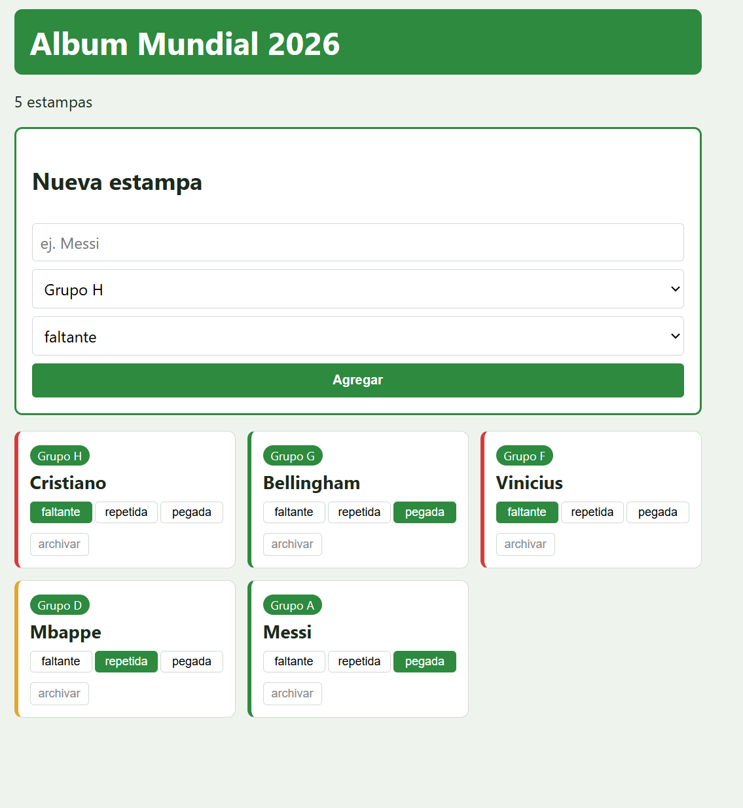

# Album Mundial 2026

Proyecto Web - STW 2026, UVG. Fase 2.

App para llevar control de mi album Panini del Mundial 2026. Marco estampas faltantes, repetidas y pegadas, organizadas por los 12 grupos del Mundial.

## Stack

- Frontend: React 18 + Vite
- Backend: Express + PostgreSQL (pg)

## Como correr

Backend:

```
cd backend
npm install
cp .env.example .env
createdb album_mundial2026
npm run init-db
npm run dev
```

Frontend:

```
cd frontend
npm install
npm run dev
```

Por default arranca en modo **Local** (LocalStorage). Con el switch de la barra superior cambio a modo **API** (golpea al backend en `http://localhost:3001`). El modo se queda guardado entre sesiones.

## Endpoints

- GET /api/items
- POST /api/items
- PUT /api/items/:id
- DELETE /api/items/:id (archiva, no borra)
- POST /api/items/:id/registro

## Tablas

items: id, nombre, categoria_id, estado, atributos (jsonb), activo

registros: id, item_id, fecha, valor, notas

## Fase 2 - lo que cambio

- `src/context/StorageProvider.jsx`: abstrae **API vs LocalStorage** detras de `obtenerItems`, `guardarItem`, `actualizarItem`, `eliminarItem`. Los componentes ya no preguntan `if (modo === 'api')`.
- `src/context/ThemeContext.jsx`: tema **claro/oscuro** con `document.body.setAttribute('data-theme', tema)` y persistencia en `localStorage`.
- 2 usos de `useRef`:
  1. En `FormularioItem.jsx`: ref al input de nombre para hacerle `focus()` despues de agregar una estampa (y para que `Ctrl+N` lo enfoque desde cualquier parte).
  2. En `App.jsx`: ref al `intervalId` del auto-refresh en modo API (cada 20s vuelve a pedir los items, por si los edito desde otra pestaña o desde el celular). Lo limpio en el `return` del `useEffect` y al cambiar a modo local, sin causar re-render.
- Categorias con emoji y color: cada grupo tiene la bandera de su cabeza de grupo y un color tomado de su bandera (ver `src/utils/categorias.js`).
- Atajos de teclado con `removeEventListener` en el cleanup:
  - `Ctrl+N`: enfoca el input del nombre.
  - `T`: cambia el tema (lo ignora si estoy escribiendo en un input).

## Mi paleta de colores

Como el album es de futbol elegi una paleta verde (cesped) con dorado (trofeo). Mande los hex a la pestaña de "contrast checker" de Chrome para asegurarme que el texto pase AA en los dos temas.

### Tema claro

| Variable | Hex | Por que ese hex |
|---|---|---|
| `--bg`        | `#f3f6ed` | Verde muy palido en vez de blanco puro. Si dejaba blanco las cards (tambien blancas) no se diferenciaban. |
| `--surface`   | `#ffffff` | Blanco para las cards, asi resaltan sobre el fondo verdoso. |
| `--border`    | `#c8d4bf` | Verde grisaceo bajo. Probé `#dddddd` gris neutro y se veia desconectado del fondo verde. |
| `--text`      | `#1d2a1d` | Casi negro pero con un toque de verde para que combine. El negro puro `#000` se veia muy duro. |
| `--primary`   | `#2d8a3e` | Verde tipo cesped, que combina con la idea del mundial. Mas oscuro que el verde tipico de Bootstrap. |
| `--accent`    | `#c5a046` | Dorado para los acentos. Lo uso poco, solo lo deje pensando en el trofeo. |

### Tema oscuro

| Variable | Hex | Por que ese hex |
|---|---|---|
| `--bg`        | `#0f1a14` | Verde casi negro en vez de `#000` puro, para que combine con el verde del tema claro. |
| `--surface`   | `#1a2820` | Un escalon mas claro que el fondo para que las cards se vean separadas. |
| `--border`    | `#2d3d34` | Bordes apenas visibles, lo suficiente para separar cards sin hacer ruido. |
| `--text`      | `#e8efe6` | Blanco con un toque de verde. Blanco puro sobre fondo verde oscuro me molestaba los ojos de noche. |
| `--primary`   | `#4caf5a` | El `#2d8a3e` del tema claro sobre fondo oscuro se veia turbio, asi que lo subi de brillo. |
| `--accent`    | `#e6c060` | Dorado mas saturado que en claro. En oscuro los amarillos opacos se ven verdosos. |

## Capturas

### Fase 1 (estado inicial)



### Fase 2 (estado actual)


**Lo que cambia visualmente entre fase 1 y fase 2** (todo visible en la captura de arriba):

- **Barra superior con 2 controles nuevos**: boton de tema (☀️ claro / 🌙 oscuro) y switch de modo (💾 Local ↔ ☁️ API).
- **Tema oscuro funcional**: la captura esta tomada en oscuro. En fase 1 solo existia el verde claro.
- **Cards con bandera y color por grupo**: ahora cada categoria muestra el codigo del pais cabeza de serie (MX, AR, FR, ES, DE) y el borde superior toma el color de la bandera. En fase 1 todas las cards eran iguales.
- **Footer con atajos visibles**: `Ctrl+N` para enfocar el input y `T` para cambiar tema.

## Decisiones de scope - fase 2

En el README de la fase 1 escribi que en la fase 2 queria pre-cargar el album entero con un seed (~993 estampas: 19 FWC + 48 paises × 20 + 14 CC) y cambiar la UI a un grid tipo planilla. **No lo hice en esta fase y fue a proposito**.

La rubrica de fase 2 puntea 4 cosas concretas: StorageContext hibrido (30 pts), modo API↔Local (15), ThemeContext (15), useRef minimo 2 usos (15), categorias con emoji/color (10) y git+README+paleta (15). Esos 100 pts son los que prioricé.

El seed + grid son cambios grandes (schema nuevo con `codigo`/`pais`/`numero`, endpoint nuevo `PATCH /api/items/:codigo/estado`, vista grid agrupada, indicador de progreso, migrar las estampas viejas) y si los metia ahora me iban a comer el tiempo de los contextos y los useRef, que son lo que se evalua. Preferi entregar lo de la rubrica completo y dejar el seed/grid para fase 3, cuando ya pueda iterar sobre una base estable.

## Pendiente para fase 3

- `backend/src/db/seed.js` con las ~993 estampas oficiales (FWC1-FWC19, MEX1-MEX20, RSA1-RSA20, ..., PAN1-PAN20, CC1-CC14).
- Schema: agregar `codigo TEXT UNIQUE`, `pais TEXT`, `numero INT` a `items`.
- `PATCH /api/items/:codigo/estado` para marcar por codigo en vez de UUID (mas rapido desde el grid).
- `VistaAlbum.jsx`: grid agrupado por pais, click cicla faltante → pegada → repetida → faltante. El formulario actual queda como "modo manual" para estampas fuera del seed.
- Indicador "678/993 pegadas (68%)" arriba del grid.
